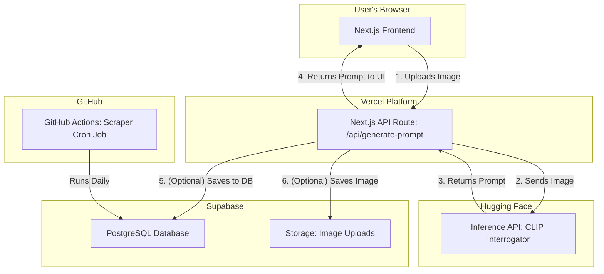

# System Architecture

This document provides a high-level overview of the technical architecture for the images&prompts application.

## Components

-   **Frontend (`apps/web`)**: A Next.js application hosted on Vercel. It provides the user interface for uploading images and browsing prompts.

-   **Backend API (`apps/web/pages/api`)**: Serverless functions, also hosted on Vercel as part of the Next.js app. They handle business logic like processing image uploads and communicating with third-party services.

-   **AI Model (`packages/prompt-model`)**: A wrapper that communicates with a hosted Hugging Face Inference API (specifically, the CLIP Interrogator model) to generate prompts from images.

-   **Database (`infra/supabase-schema.sql`)**: A PostgreSQL database hosted by Supabase. It stores user data, prompts, and image metadata.

-   **Storage**: Supabase Storage is used to store the images uploaded by users.

-   **Scraper (`apps/scraper`)**: A Python script scheduled to run periodically via GitHub Actions. It will crawl public sources for prompts and populate the Supabase database.